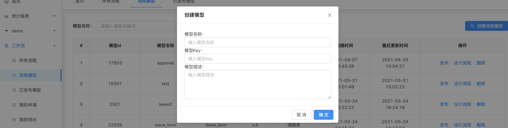

Jeecg-Boot 快速开发平台-jeecg-boot-activiti-online
===============
[TOC]

## 前言

- 本项目是基于 https://github.com/happy-panda/jeecg-boot-activiti 的基础上进行的再次开发，修改了一些代码结构，增加了一些功能，除了增加的代码，主体代码基本都源于原作者，感谢原作者**happy-panda**: https://github.com/happy-panda 的开源贡献。

- 而其根本项目则是基于 https://github.com/jeecgboot/jeecg-boot 开源版。

- 本项目主要在jeecg-boot-activiti的基础上添加了online模块自动添加activiti代码的功能（支持单表，多表等多种风格），并在原版本activiti功能上扩展了一些功能，比如添加表单组件管理页面在页面上进行组件管理，表单支持多表等；其次修复了一些bug，包括原来基础版本和jeecg-boot-activiti的一些bug。

- 由于本人之前参考的基础版本是v.2.4.2，并且本人所做修改已经过去很长时间，所以这里选用的版本也是 v.2.4.2，之后升级的版本理论上应该不会影响activiti的功能。如有升级需求可自行酌情升级。
-  本项目是自己对开源研究的扩展，欢迎大家共同研究。由于主要是对activiti模块的online扩展，所以关于jeecg-boot的问题，请联系jeecg团队，关于activiti的问题，请联系原作者。如有关于activiti online模块的问题，可留言讨论，谢谢！

## 使用说明

> 本使用说明主要聚焦在如何使用本项目提供的online activiti功能使用上，不包含activiti的具体用法，关于activiti，可以参考官方资料或其他资料。

### 启动前数据库和redis相关

#### 配置

本人为了操作方便，在application-dev.yaml文件中使用环境变量替换了数据库和redis的host和ip配置：

```yaml
...
datasource:
  master:
    url: jdbc:mysql://${HOST_IP_PORT}/jeecg-boot...
...
redis:
  database: 0
  host: ${REDIS_HOST_IP}
...
```

如果不准备采用这种方式，可以使用原来基础版的方式。

#### 数据库数据准备

请在按照你的数据库类型在数据库中执行**jeecg-boot-module-activiti**模块db文件夹下的sql文件，第一次使用create文件夹下的，然后执行update.sql，请根据对应的具体数据库执行或修改执行。

### 启动后

#### 菜单授权

给activiti相关菜单授权，现在应该可以在左侧菜单栏看到工作流的菜单了。

#### 创建发布流程模型

这个流程的主要部分和之前没有变化，但是原来版本中需要在文件中配置表单组件，我这里进行了修改，可以在表单组件管理菜单上进行管理，在这个界面点击添加表单组件，按照说明根据你的表单信息填写相应字段即可。

就是在流程模型菜单中创建新的模型，然后在已发布模型菜单中进行编辑，在这里可以预览关联的表单，这里的表单即是上一步你在表单组件管理中创建的表单组件。编辑完成后再按需求进行节点设置，之后启用即可。

#### 申请

原来的版本中，由于不支持online，只能通过我的申请菜单进行申请，并且代码逻辑需要自己去写，包括前端和后端的代码。在这个项目中，我们只需要在online表单开发中，数据库属性增加act_status字段，默认值为**未提交**（这里可以在代码中默认，但是偷懒没改，有兴趣的小伙伴可以提交pr），字段备注大概就是审核状态之类的描述，然后页面属性中表单显示不勾选此字段，列表显示可按大家需求勾选即可。

生成代码后，我们可以发现相比于不加act_status字段的代码有了变化，这些变化即是activiti相关的逻辑。重新部署后，我们在自己项目的表单页面上新增一条数据后，可以在详情下面找到**提交申请**（主表的按钮情况可能不同，但**提交申请**是有的），点击以后的流程和我们在申请菜单中的流程一样。工单的状态会更新到表单数据中的审核状态一列中。

### Demo

> 由于没有上传数据库数据，所以如果你直接使用此demo在本地，应该会报错，demo只是参考，可以自己实际动手按照demo的步骤执行。

#### 单表

##### 创建流程模型

在**工作流**菜单下的**流程模型**子菜单中，点击**创建流程模型**按钮：



然后输入必要参数，创建好需要的流程后，点击发布。

##### Online表单开发

在**在线开发**菜单下的**Online表单开发**子菜单中，点击新增，这里我们创建一个名字叫做approval的单表，然后在**数据库属性**中填入如下字段，其中**act_status**是必须字段，而且其默认值必须是***未提交***。在页面属性中将**act_status**字段的表单显示去掉，只保留列表显示（当然具体看自己需求，也可去掉列表显示）。


保存以后，点击**代码生成**按钮，按照各自业务需求生成代码，然后按照[官方文档](http://doc.jeecg.com/2043916)中的进行配置，我们最后可以看到这样的结果：


##### 关联模型与表单

表单生成后，我们需要将其和模型关联起来，这里总共分为两步：

###### 添加表单组件

我们需要将表单做为一个组件，在**工作流**菜单下的**表单组件管理**子菜单中，点击**添加表单组件**按钮：


然后填入相应的值，这里的表单组件路由和路径和菜单配置中很像，这里填写代码生成中生成的act前端文件路径。业务表类型我们这里选择单表。如果是其他类型，请注意该form中其他信息的提醒：


###### 编辑流程

下面将表单组件和流程进行关联，在**工作流**菜单下的**已发布模型**子菜单中，在刚创建好的流程右边点击**编辑**，按照业务需求选择和填写，这里的**关联表单**字段所关联的就是我们之前创建的表单组件，我们选择***审批***：


##### 编辑流程节点

在**已发布模型**子菜单中，我们还可以编辑流程节点，点击**节点设置**，可以在我们设计的流程环节中设置审批人员：


##### 发起申请

走完前面流程，我们就可以针对创建的表单发起申请了，在这里有三个地方可以发起申请：

###### 表单页面新增数据

这是最常用的一种方式，在我们的demo中新增一条数据：


点击**确定**之后，我们即发起了一个申请：


###### 发起申请在所有流程页

在**工作流**菜单下的**所有流程**子菜单中，每一个卡片页中都是我们的表单组件，在卡片右上角可以点击**发起申请**，然后会弹出approval表单，填写之后会新增一条数据，并且发起申请：


###### 发起申请在我的申请页

在**工作流**菜单下的**我的申请**子菜单中，右上角有**发起申请**按钮，点击该按钮，会出现与所有流程页面上相同的卡片页，我们可以在卡片右上角可以点击**发起申请**，其效果和**发起申请在所有流程页**一样：


##### 提交申请

发起申请后，该数据审核状态是我们默认的**未提交**状态，在**工作流**菜单下的**我的申请**子菜单中可以找到对应的申请。我们可以在两个地方提交申请。

###### 提交申请在表单页

在appraval表单中新增数据的行右边点击**提交申请**即可：


###### 提交申请在我的申请页

之前说过，发起申请后，我们可以在**我的申请**页面找到对应的申请，在这条记录的右边可以点击提交申请：


##### 其他

在**工作流**菜单下的其余菜单基本都是工单的几个状态查看，这里不多做介绍。对于其他表类型如：单表（树）以及主表（一对多、树、erp、内嵌、jvxe、tab）和单表差不多，不同之处在上文中也有提及。

## 结语

最后再次感谢jeecg-boot团队提供的优秀的开源版本，以及happy-panda提供的非常实用的activiti模块，由于本人水平有限，代码比较粗糙，欢迎各位提供pr来优化代码。如有相关使用问题也欢迎提交issue共同讨论。
